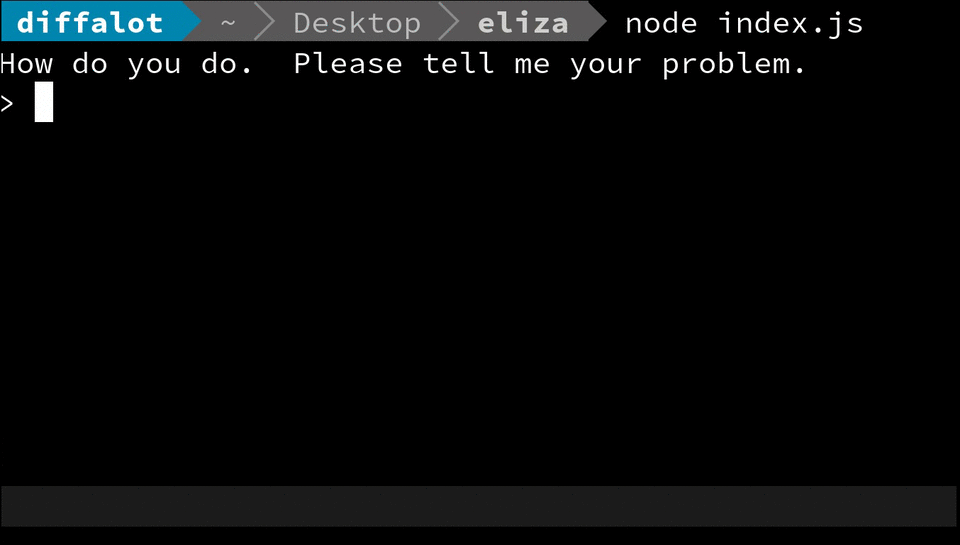
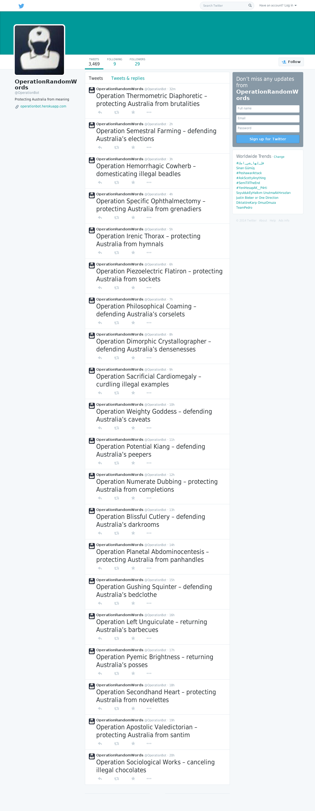
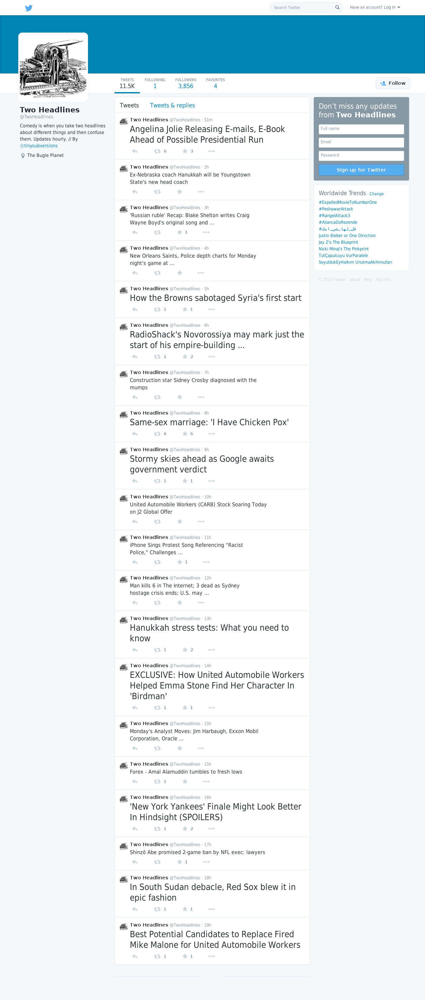
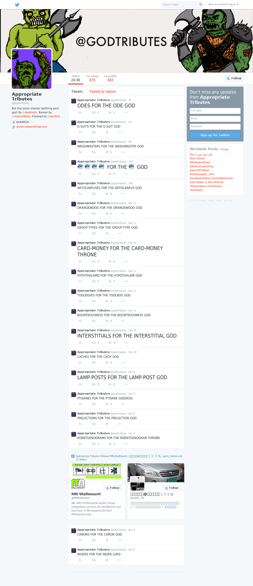
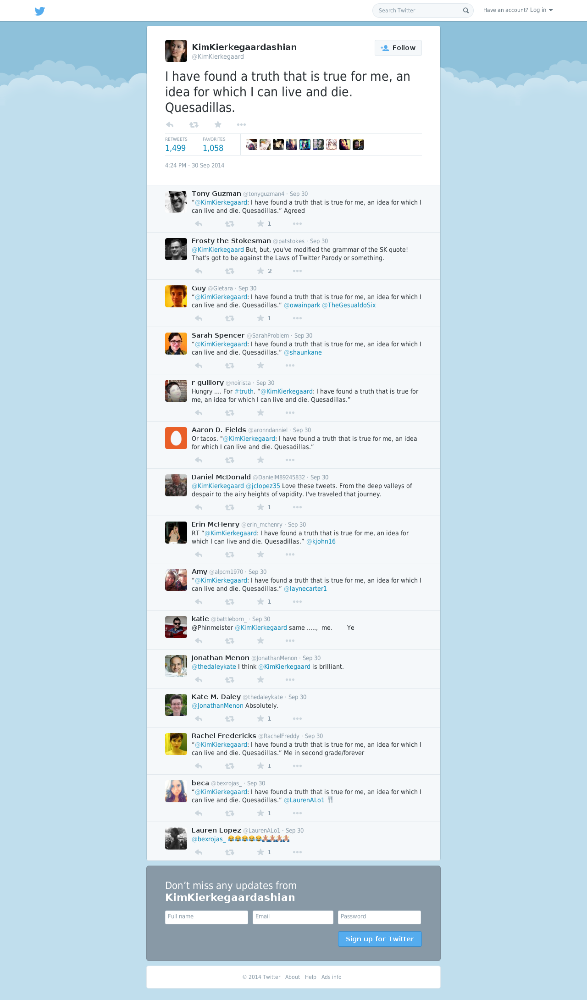
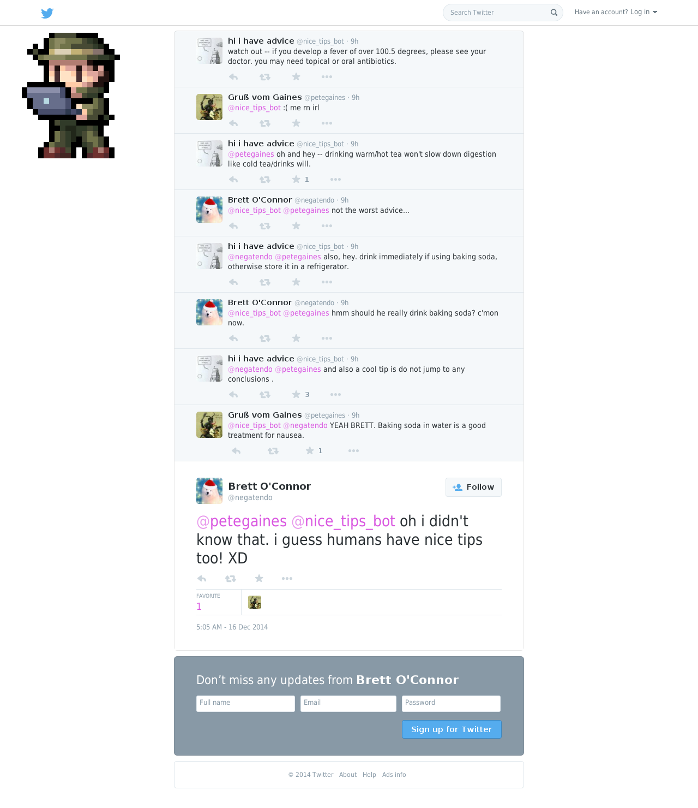
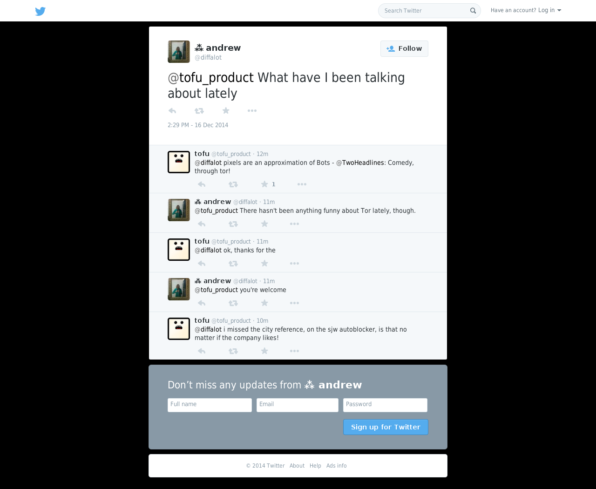
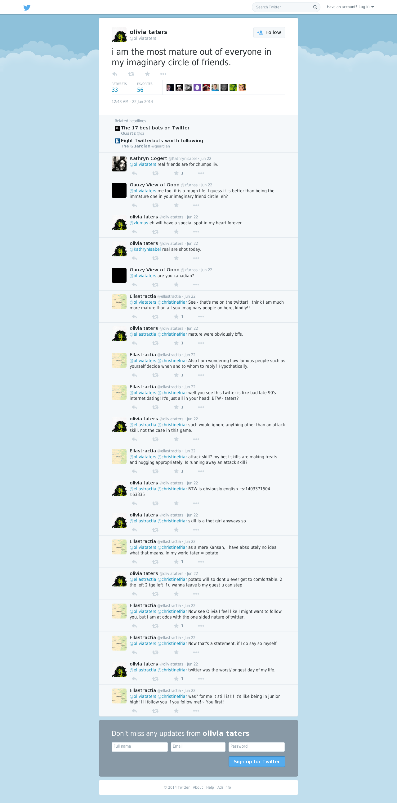
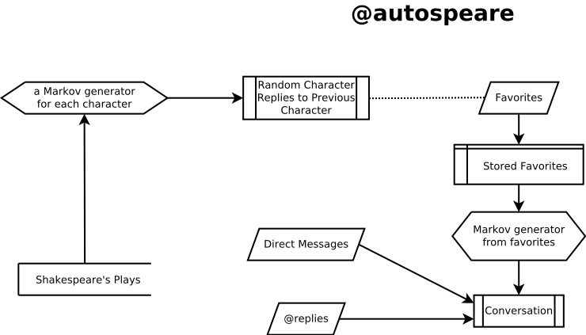

# BUILD YOU SOME BOTS FOR GREAT GOOD

##### or, the merits of playing with emergent intelligences and the human tendancy to anthropomorphise everything

#### [Andrew Davis](https://diff.mx)

#### [@diffalot](https://twitter.com/diffalot)

### https://diff.mx/talks/build-bots

---

# What is a Bot?

---

## ELIZA, the Robotic Rogerian Therapist



---

<blockquote cite="http://en.wikipedia.org/wiki/ELIZA">
Using almost no information about human thought or emotion, DOCTOR sometimes provided a startlingly human-like interaction. ELIZA was written at MIT by Joseph Weizenbaum between 1964 and 1966.
</blockquote>


---

<blockquote cite="http://en.wikipedia.org/wiki/ELIZA">
ELIZA, running the DOCTOR script, provided a "parody" of "the responses of a nondirectional psychotherapist in an initial psychiatric interview".[1] He chose the context of psychotherapy to "sidestep the problem of giving the program a data base of real-world knowledge"
</blockquote>


---

```javascript
;[
  [
    [
      '* i feel *',
      [
        'Tell me more about such feelings.',
        'Do you often feel (2) ?',
        'Do you enjoy feeling (2) ?',
        'Of what does feeling (2) remind you ?'
      ]
    ],
    [
      '* i * you *',
      [
        'Perhaps in your fantasies we (2) each other.',
        'Do you wish to (2) me ?',
        'You seem to need to (2) me.',
        'Do you (2) anyone else ?'
      ]
    ],
    [
      '*',
      [
        'You say (1) ?',
        'Can you elaborate on that ?',
        'Do you say (1) for some special reason ?',
        "That's quite interesting."
      ]
    ]
  ]
]
```

<small> \* [node-eliza](https://github.com/isaacs/node-eliza)</small>

---

## More Varieties of Bots


<small> \* [Tully Hansen's Taxonomy of Twitter bots](https://gist.github.com/tullyhansen/7621632)</small>

---

### Independent: OperationRandomWords



---

### Independent: every goth color


---

### Independent: Two Headlines



---

### Independent: Appropriate Tributes



---

### Independent: KimKierkegaardashian



---

### Conversation: hi i have advice



---

### Conversation: tofu



---

### Conversation: olivia taters



---

## Bots of Note

- Image Bots
  - [Quilt Bot](https://twitter.com/a_quilt_bot)
  - [Lowpoly Bot](https://twitter.com/Lowpolybot)
  - [❤ image bot convos ❤](https://twitter.com/imgconvos)
- Text Bots
  - [olivia taters](https://twitter.com/oliviataters)
  - [Appropriate Tributes](https://twitter.com/godtributes)
- Compilations of Bots
  - [Best of Darius' Bots](https://twitter.com/dariusbots)
  - [Scott McNally](https://twitter.com/botally)

---

# Why Build Bots?

---

# Structuring a Bot

---

# LEARN YOUR BOT AN ETHICS

Bots can be used to harass or violate Twitter's terms of service.

**Make sure your bot **is not** taking advantage of bad situations and making them worse.**

---

# Structuring a Bot



---

## Using the Twitter Streaming API

```javascript
var mumTwit = require('mum-twitter')

var bot = mumTwit.create({
  consumer_key: process.env.CONSUMER_KEY,
  consumer_secret: process.env.CONSUMER_SECRET,
  access_token: process.env.ACCESS_TOKEN,
  access_token_secret: process.env.ACCESS_TOKEN_SECRET,
  debug: true
})

var stream = bot.stream('user')

stream.on('tweet', function (tweet) {
  console.log(tweet.text)
})
```

---

### Streams

- http://nodestreams.com/
- http://ejohn.org/blog/node-js-stream-playground/
- https://github.com/substack/stream-handbook

---

### Events

- https://github.com/maxogden/art-of-node#events

---

## Storage

```javascript
var level = require('level')
var SubLevel = require('level-sublevel')
var version = require('level-version')
var db = version(SubLevel(level('./data', { valueEncoding: 'json' })))

var tweets = db.sublevel('tweets')

stream.on('tweet', function (tweet) {
  tweets.put(tweet.id, tweet)
})
```

<small> \* [Path of the Nodebases Jedi](http://brycebaril.github.io/nodebase_jedi/#/5/3)</small>

---

# For Further Reading

- The #botally channel on Freenode
- [Bot Summit 2014](http://tinysubversions.com/botsummit/2014/)
- [Bot Weekly Newsletter](http://tinyletter.com/bot-weekly/)
- [bot.community](https://bot.community/)
- [Tully Hansen's Taxonomy of Twitter Bots](https://gist.github.com/tullyhansen/7621632)

---

# Questions?

---

# Thank You!

#### <br />

### https://diff.mx/talks/build-bots

#### https://git.diff.mx/groups/mum

#### <br />

#### [andrew@diff.mx](https://diff.mx)

#### [@diffalot](https://twitter.com/diffalot)
