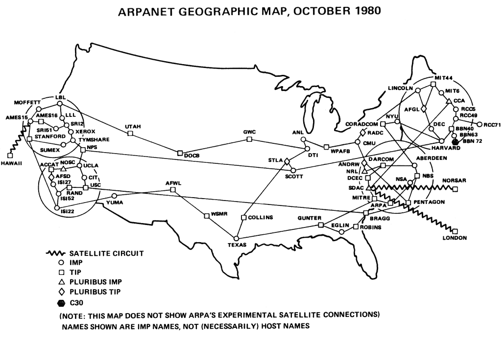
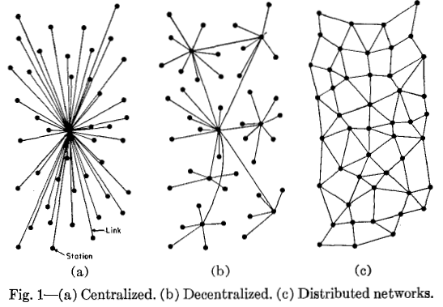
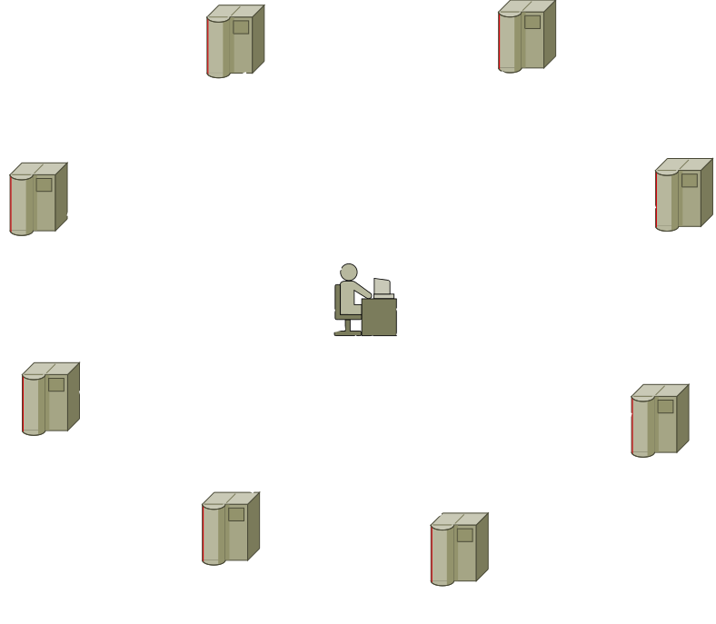
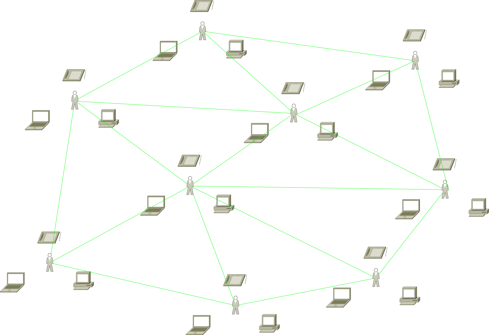

# INTRODUCING MTOS

##### surveillance resistant peer to peer social networking

#### [Andrew Davis](https://diff.mx)
#### [@diffalot](https://twitter.com/diffalot)

### https://diff.mx/talks/introducing-mtos

---

# Internet Devolution

* The Internet Used to be Decentralized
* Now Everything is Siloed

----

from Richard T. Griffiths' [History of the Internet](http://www.let.leidenuniv.nl/history/ivh/chap2.htm).

----

illustration from _On Distributed Communication Networks_ by Paul Baran.

----

----

---

# How it Works

1. You generate a GPG Keypair in your browser
1. You can replicate your keypair to another browser for multiple terminals
1. You share your public key with others
1. Others share their public keys with you
1. You use WebTorrent as a dead drop for encrypted messages
1. You let people know you're seeding messages for them via a swarm of WebRTC channels

----

# What it's Made Of

* [Forge](https://github.com/digitalbazaar/forge) - TLS implemented in JavaScript for lots of PKI infrastructure
* [WebTorrent](https://webtorrent.io/) - BitTorrent between Browsers
* [Secure Scuttlebut](https://github.com/ssbc/secure-scuttlebutt) - A gossip network for message replication
* [Friends Swarm](https://github.com/moose-team/friends-swarm) - The implementation of secure scuttlebut actually used

----

# Infrastructure Servers

* [Signalhub](https://github.com/mafintosh/signalhub)
* [bittorrent-tracker](https://github.com/feross/bittorrent-tracker)

---

# Known Vulnerabilities

* Browser storage is not encrypted
* Peer network can be monitored to detect user graph

----

# Current Status

* at v0.0.0
* in the middle of a rewrite of the reference implementation
* that will require a rewrite of the library
* it's totally unorganized

---

# Questions?

---

# Thank You!

####  

### http://mtos.co/
* https://git.diff.mx/mtos/mtos
* https://git.diff.mx/mtos/mtos-client-angular
* http://docs.mtos.co

####  

#### https://diff.mx/talks/introducing-mtos

####  

#### [andrew@diff.mx](https://diff.mx)
#### [@diffalot](https://twitter.com/diffalot)
