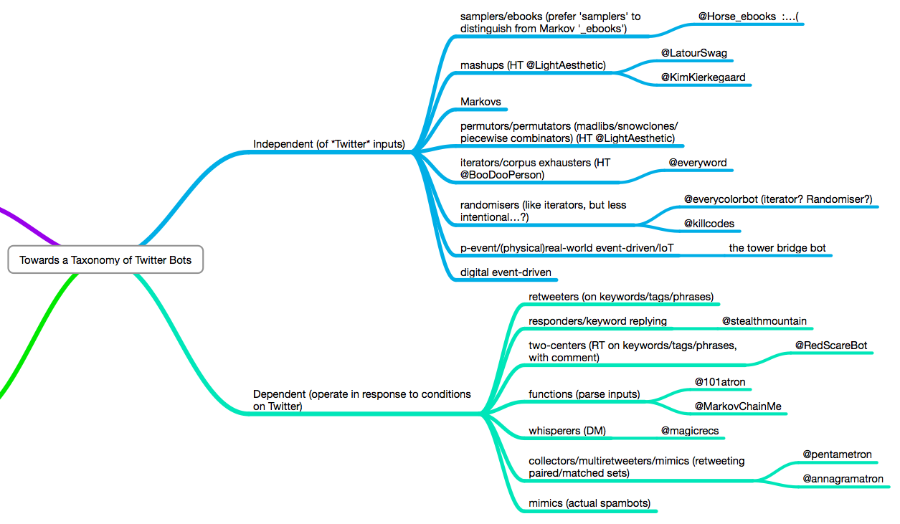

# BUILD YOU SOME BOTS FOR GREAT GOOD

##### or, the merits of playing with emergent intelligences and the human tendancy to anthropomorphise everything

#### [Andrew Davis](https://diff.mx)
#### [@diffalot](https://twitter.com/diffalot)

### https://diff.mx/talks/build-bots

---

## What is a Twitter Bot?

----

# A Chat Bot

----

# An Independent Bot

----

# An Image Bot

----

# A Video Bot

----

## More Varieties of Bots



<small> * [Tully Hansen's Taxonomy of Twitter bots](https://gist.github.com/tullyhansen/7621632)</small>

----

## Bots of Note

* Image Bots
    * [Quilt Bot](https://twitter.com/a_quilt_bot)
    * [Lowpoly Bot](https://twitter.com/Lowpolybot)
    * [❤ image bot convos ❤](https://twitter.com/imgconvos)
* Text Bots
    * [olivia taters](https://twitter.com/oliviataters)

---

# Why Build Bots?

---

# Structuring a Bot

----

# LEARN YOUR BOT AN ETHICS

Bots can be used to harass or violate Twitter's terms of service.

**Make sure your bot **is not** taking advantage of bad situations and making them worse.**

----

# Structuring a Bot

----

# ~LEARN YOU AN ETHICS~
# Asimov's 3 Laws

----

## Using the Twitter Streaming API

```javascript
var mumTwit = require('mum-twitter');

var bot = mumTwit.create({
    consumer_key: process.env.CONSUMER_KEY,
    consumer_secret: process.env.CONSUMER_SECRET,
    access_token: process.env.ACCESS_TOKEN,
    access_token_secret: process.env.ACCESS_TOKEN_SECRET,
    debug: true
});

var stream = bot.stream('user');

stream.on('tweet',function(tweet){
  console.log(tweet.text);
});
```

----

### Streams

* http://nodestreams.com/
* http://ejohn.org/blog/node-js-stream-playground/
* https://github.com/substack/stream-handbook

----

### Events

* https://github.com/maxogden/art-of-node#events

----

## Storage

```javascript
var level = require('level');
var SubLevel = require('level-sublevel');
var version = require('level-version');
var db = version(SubLevel(level('./data', {valueEncoding:'json'})));
var tweets = db.sublevel('tweets');

stream.on('tweet',function(tweet){
  tweets.put(tweet.id, tweet);
});


```

<small> * [Path of the Nodebases Jedi](http://brycebaril.github.io/nodebase_jedi/#/5/3)</small>

---

# Text Generation

----

## Mad Libs

----

## Markov Chain Generators

---

## For Further Reading

* [Bot Summit 2014](http://tinysubversions.com/botsummit/2014/)
* [Bot Weekly Newsletter](http://tinyletter.com/bot-weekly/)
* [bot.community](https://bot.community/)
* [Tully Hansen's Taxonomy of Twitter Bots](https://gist.github.com/tullyhansen/7621632)

---

# Questions?

